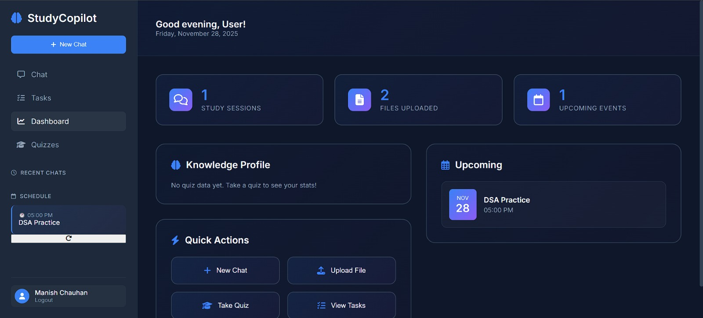
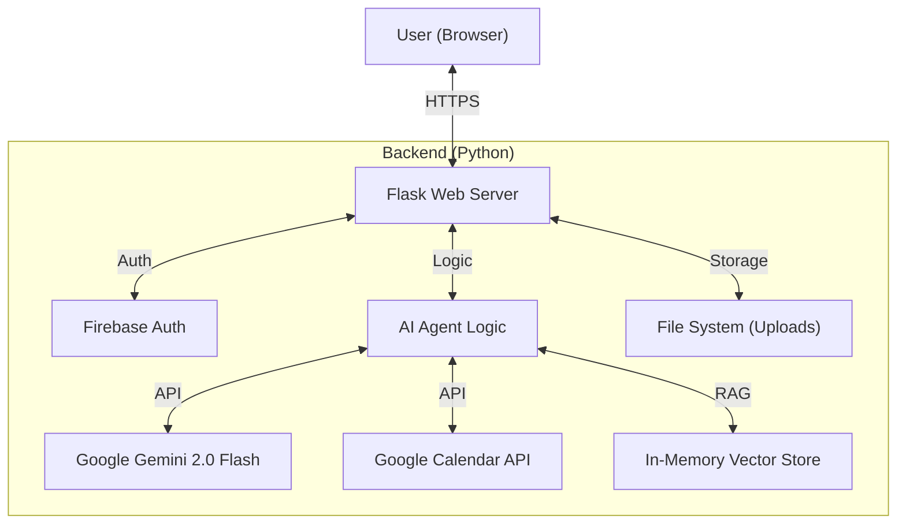
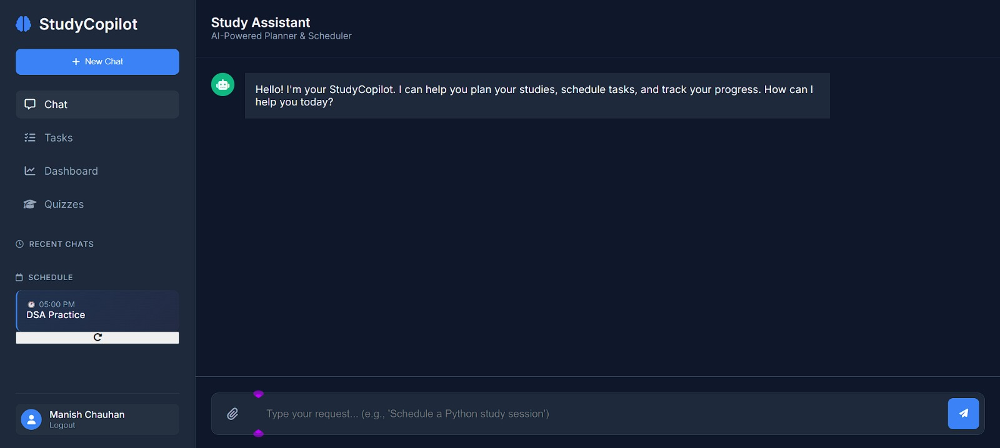
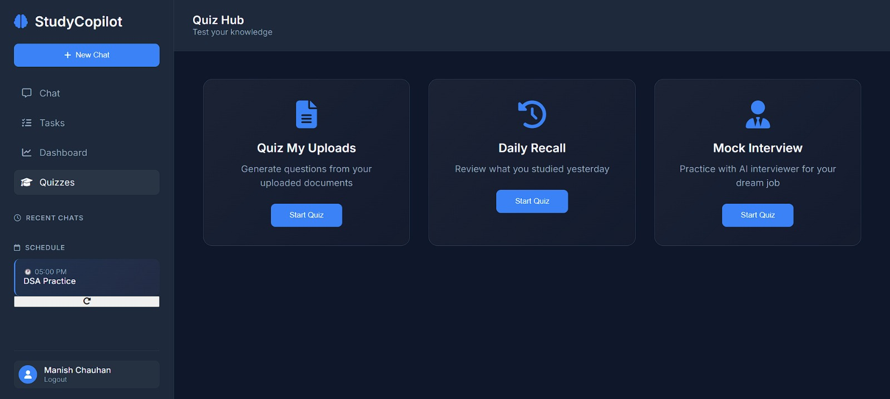
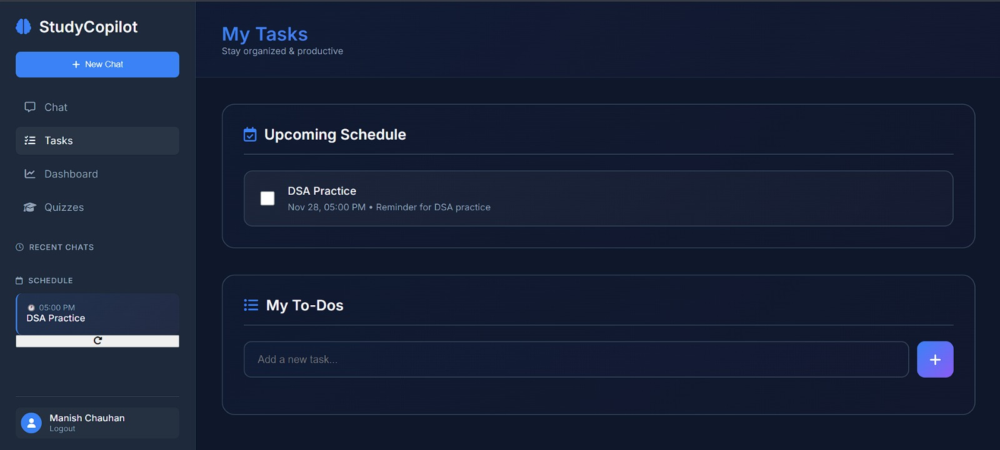

# StudyCopilot 🎓🤖

**Your AI-Powered Personal Study Mentor & Time Manager**



## 📖 The Problem
Students and self-learners often struggle with three main challenges:
1.  **Time Management**: Difficulty creating and sticking to a study schedule.
2.  **Information Overload**: Managing vast amounts of study materials (PDFs, notes) and retrieving relevant information quickly.
3.  **Self-Assessment**: Lack of personalized quizzes and mock interviews to test knowledge retention effectively.

Existing tools are fragmented—calendar apps for scheduling, separate note-taking apps, and generic AI chatbots that don't know your specific context or schedule.

## 💡 The Solution
**StudyCopilot** is an integrated web application that combines the power of **Google Gemini 2.0 Flash** with your personal **Google Calendar** and **Study Materials**. It acts as a proactive mentor that not only answers your questions but also manages your time and tests your knowledge.

### Key Capabilities:
*   **📅 Smart Scheduling**: "Hey, schedule a DSA practice session for tomorrow at 8 PM." (Automatically adds to Google Calendar).
*   **🧠 Context-Aware RAG**: Upload your textbooks (PDFs) and ask questions. The AI answers *only* based on your materials.
*   **📝 AI Quizzes**: Generate custom quizzes from your uploaded files or "Daily Recall" quizzes based on what you studied yesterday.
*   **🎤 Mock Interviews**: Simulate job interviews for specific roles with real-time AI feedback and scoring.
*   **🔒 Privacy & Isolation**: Multi-user support ensures your chats and files are private to your account.

---

## 🏗️ Architecture

StudyCopilot is built as a monolithic Flask application for simplicity and ease of deployment, leveraging powerful cloud APIs for intelligence and storage.




### Tech Stack
*   **Frontend**: HTML5, CSS3 (Modern/Glassmorphism), Vanilla JavaScript.
*   **Backend**: Python 3.10+, Flask.
*   **AI Model**: Google Gemini 2.0 Flash (`google-generativeai`).
*   **Authentication**: Google Firebase Authentication.
*   **Integrations**: Google Calendar API, Google Drive (optional for future).
*   **Deployment**: PythonAnywhere (WSGI).

---

## ✨ Features

### 1. 🤖 Intelligent Chat Agent
*   Conversational interface with a "Mentor" persona.
*   Understands context (date, time, user name).
*   Handles complex queries combining study help and scheduling.

### 2. 📅 Calendar Integration
*   **View**: See upcoming events directly on the dashboard.
*   **Create**: Natural language event creation ("Remind me to study...").
*   **Update/Reschedule**: "I missed yesterday's session, move it to Sunday."
*   **Delete**: Remove events via chat.

### 3. 📚 RAG (Retrieval-Augmented Generation)
*   Upload PDF, TXT, or MD files.
*   Files are indexed instantly.
*   Ask questions like "Summarize Chapter 3 from my uploaded PDF."

### 4. 🎯 Interactive Quizzes
*   **"Quiz My Uploads"**: Generates multiple-choice questions from your specific documents.
*   **"Daily Recall"**: Checks your calendar for yesterday's study topics and quizzes you on them.
*   **Knowledge Profile**: Tracks your scores by topic (e.g., Python: 80%, DSA: 60%).

### 5. 💼 Mock Interview Simulator
*   Choose a role (e.g., "Frontend Developer").
*   AI asks relevant questions.
*   You type answers, and AI provides a score (1-10) and detailed feedback.

---

## 🚀 Setup & Installation

### Prerequisites
*   Python 3.10 or higher.
*   A Google Cloud Project with **Gemini API** and **Google Calendar API** enabled.
*   A **Firebase** project for Authentication.

### 1. Clone the Repository
```bash
git clone https://github.com/manish930s/studycopilot
cd studycopilot
```

### 2. Install Dependencies
```bash
pip install -r requirements.txt
```

### 3. Environment Configuration
Create a `.env` file in the root directory:
```ini
GOOGLE_API_KEY=your_gemini_api_key_here
FLASK_SECRET_KEY=your_random_secret_string
```

### 4. Firebase & Google Auth Setup
1.  Go to `templates/login.html`.
2.  Replace the placeholder `firebaseConfig` object with your actual Firebase credentials.
3.  Replace `YOUR_GOOGLE_CLIENT_ID` with your OAuth 2.0 Client ID.
4.  **Important**: Add `http://127.0.0.1:5000` to your Authorized Origins in both Google Cloud Console and Firebase Console.

### 5. Run Locally
```bash
python agent_app.py
```
Visit `http://127.0.0.1:5000` in your browser.

---

## ☁️ Deployment (PythonAnywhere)

This project is optimized for deployment on **PythonAnywhere** (Free Tier).

1.  **Upload Code**: Upload all files to `/home/yourusername/mysite/`.
2.  **Virtual Env**: Create a virtualenv and install requirements.
3.  **WSGI Config**: Update the WSGI file to point to your app.
    ```python
    import sys
    import os
    path = '/home/yourusername/mysite'
    if path not in sys.path:
        sys.path.append(path)
    
    from agent_app import app as application
    ```
4.  **Static Files**: Map `/static` to `/home/yourusername/mysite/static`.
5.  **Reload**: Click "Reload" in the Web tab.

*See `PYTHONANYWHERE_DEPLOYMENT.md` for a detailed step-by-step guide.*

---

## 📸 Screenshots

| Dashboard | Chat Interface |
|:---:|:---:|
|  |  |

| Quiz Mode | Calendar View |
|:---:|:---:|
|  |  |

---

## 🤝 Contributing
Contributions are welcome! Please fork the repository and submit a Pull Request.


